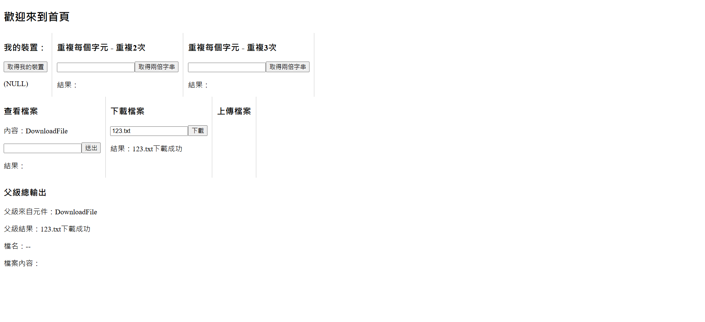
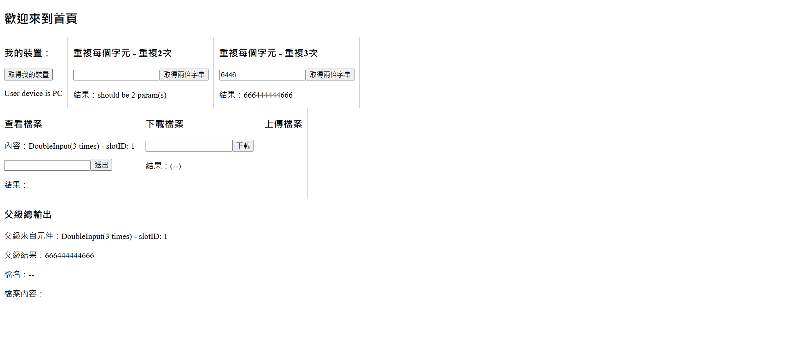

# 批量影片剪切工具
一個支援批量影片處理的桌面應用程式，使用 Haskell + PureScript + Electron 實作，
提供高效能的影片切片與前後端型別安全資料流

## 工具用途
常見某些偶像團體(如BTS)的歌曲MV，有固定的片頭或片尾，若只想保留歌曲部分，可以使用本工具來一次性的快速去除不需要的片頭(尾)

## 功能與流程

 - 批量選取影片
 - 自訂預覽圖參數
 - 生成預覽圖
 - 批量輸出剪輯結果

## 系統架構
Electron
├─ PureScript (Halogen UI)
│ └─ FFI (JS interop)
│
└─ Haskell Backend
│ └─ HTTP Server (manual)
│ └─ Thread Pool
│ └─ File Processing
│ └─ Error System

## 技術
 - Backend-Haskell(手刻 HTTP server)
 - Frontend-Purescript + Halogen
 - Desktop-Electron
 - IPC / FFI: JavaScript bridge

## 開發者流程
#後端
chcp 65001 // 確保中文編碼
cd 進入backEnd\myServer
stack run -- +RTS -N4 // 編譯並開啟多核心伺服器
#前端
在最外層資料夾
spago bundle-app --to frontend/output/Main/index.js
esbuild frontend/output/Main/index.js --bundle --outfile=frontend/dist/bundle.js --platform=browser --format=iife
npx electron . // 執行electron

## 技術亮點

1. 型別安全 API 設計
前後端共用資料結構概念
避免 runtime mismatch
2. 自建 HTTP 傳輸層
手動構建 request / response
支援大資料分段傳輸
3. 平行處理
thread pool 加速影片處理
logger 與主線程解耦
4. FFI 設計
PureScript 無法完成的 IO 操作透過 JS bridge 解決
5. 錯誤處理系統
統一 Error type
自動轉換 HTTP status code

## 未來改善
UI workflow 優化
支援 GPU 加速轉檔
更完整 queue system

## 功能展示

